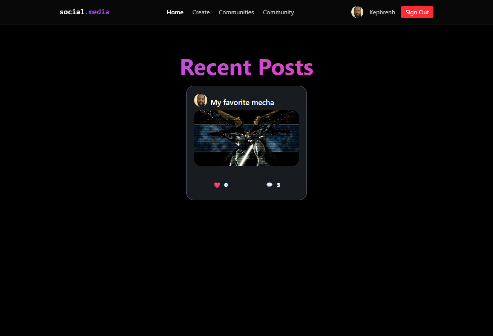
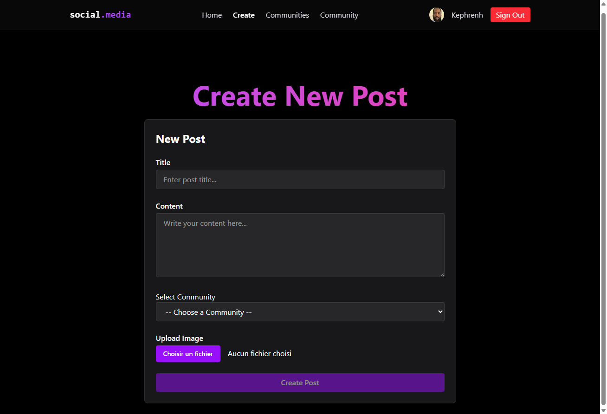
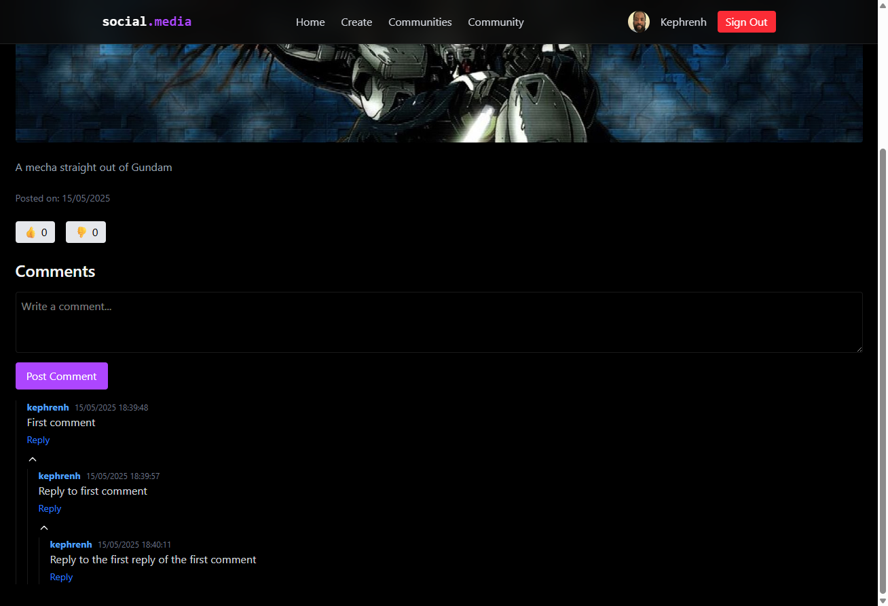
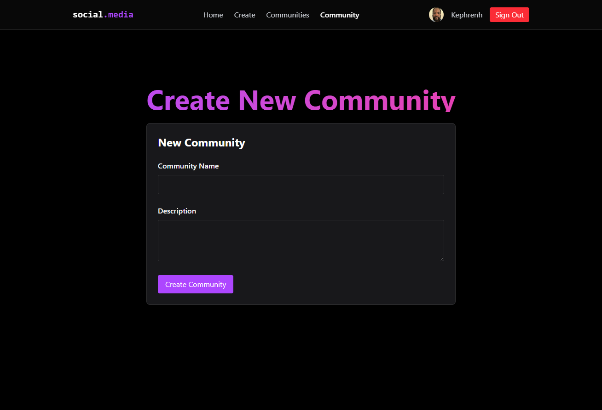
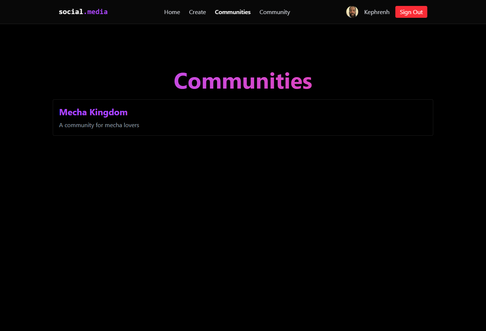

# Social Media App

A minimal social media platform built with **React 19**, **Supabase**, **TailwindCSS**, and **TanStack Query**.

This project helped me learn to:

* Integrate **Supabase** for authentication and database features
* Use **TanStack Query** for efficient data fetching and mutations
* Manage global state using **Context API**
* Build clean, modern UIs with **TailwindCSS** and **React Router v7**

---

## 🔗 Live Demo

👉 [Try the app](https://your-deployment-link.com)

---

## 📸 Screenshots

| Page             | Screenshot                                                   |
| ---------------- | ------------------------------------------------------------ |
| Homepage         |                      |
| Create Post      |         |
| Post Details     |               |
| Create Community |  |
| Communities List |        |
| Community Page   |       |

---

## 📄 Features & Pages

### 🏠 Homepage

* Displays all posts
* Each post shows author, image, and links to details

### 🧩 Create Community

* Authenticated users can create a new community
* Displays community name, description, and link to its page

### 🌐 Communities List

* Lists all available communities with details

### 📚 Community Page

* Shows a community and its associated posts
* Displays post info: likes, comments, replies

### 📝 Create Post

* Authenticated users can create a post within a selected community

### 💬 Post Details

* View individual post
* Read and reply to comments (supports nested replies)

---

## 🛠️ Tech Stack

* **React 19**
* **Supabase** (Auth + DB)
* **TailwindCSS**
* **TanStack Query**
* **React Router v7**
* **Context API**

---

## 🚀 Getting Started

```bash
npm install
npm run dev
```

---

## 📚 What I Learned

* How to set up and use Supabase for full-stack features
* Structuring global state with Context API
* Efficient data handling with TanStack Query
* Clean UI design with TailwindCSS and component-driven architecture

---

## 🙏 Credits

This project was inspired by [Build a Fullstack Reddit Clone](https://www.youtube.com/watch?v=_sSTzz13tVY) by [PedroTech (https://www.pedrotech.co)](https://www.youtube.com/@PedroTechnologies).
Big thanks for the awesome tutorial!

---

## 👤 Author

Made by [Mohamed Amoussa](https://amoussamohamed.fr)

---

Let me know if you want a French version or want to convert this into a Markdown file!
