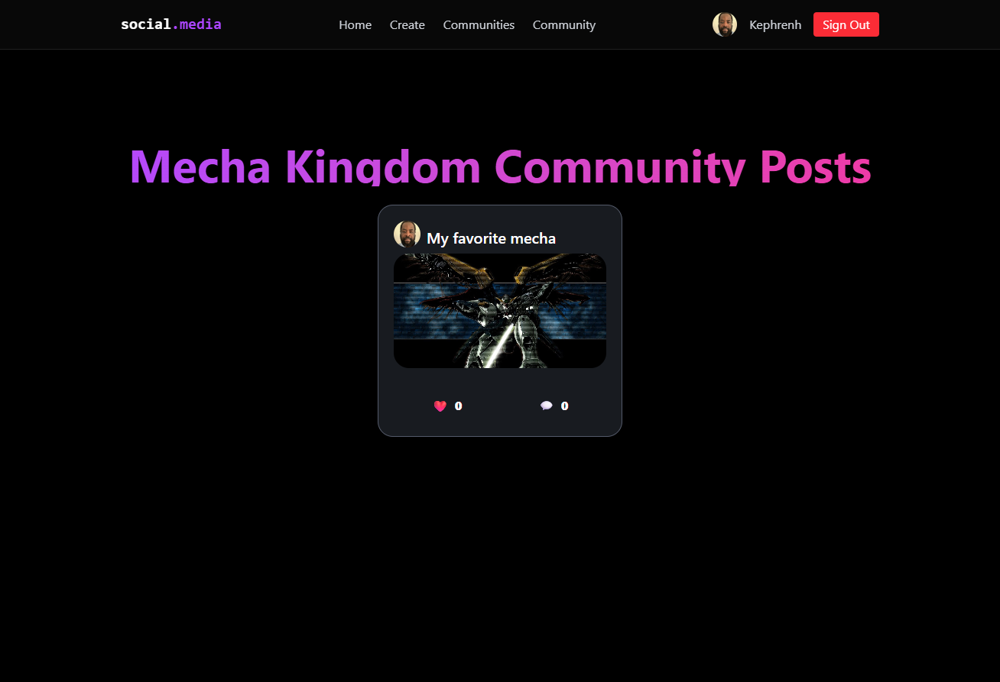

# Social Media App

A minimal social media platform built with **React 19**, **Supabase**, **TailwindCSS**, and **TanStack Query**.

This project helped me learn how to:

- Integrate **Supabase** for database and authentication
- Use **TanStack Query** for efficient data fetching and mutation
- Manage global state with **Context API**
- Organize frontend with modern React practices and routing

---

## 🔗 Live Demo

👉 [Try the app here](https://your-deployment-link.com)

---

## 📸 Screenshots

- Homepage with recent posts  
  

- Create post page  
    

- Comment & Reply Section  
  

- Create community page  
   

- Community list page  
   

- Community with posts  
   

- Comment & Reply Section  
  

---

## 📄 Pages & Features

### Homepage
- Displays a list of all user posts
- Each post shows the author, the image, and a link to its details

### Create Community
- Allows authenticated users to create and submit a new community
- Each community shows the name, description, and a link to its details

### Communities
- Displays a list of all communities
- Each community shows the name, description, and a link to its details

### Community Details
- Shows a specific community and its posts
- Users can:
  - View posts with the counts of likes, comments, and replies
  - Access the posts of the community

### Create Post
- Allows authenticated users to create and submit a new post
- User can choose a community to post in

### Post Details
- Shows a specific post and its comments
- Users can:
  - View comments
  - Reply to comments
  - See nested comment threads

---

## Tech Stack

- **React 19**
- **Supabase** (Auth + DB)
- **TailwindCSS**
- **TanStack Query**
- **React Router v7**
- **Context API**

---

## Getting Started

```bash
npm install
npm run dev
````

---

## What I Learned

* Connecting Supabase for authentication and real-time database features
* Organizing React state with the Context API
* Leveraging TanStack Query for powerful caching and mutation handling
* Building a clean and functional UI with TailwindCSS

---

## Author

Made by [Mohamed Amoussa](https://amoussamohamed.fr)


